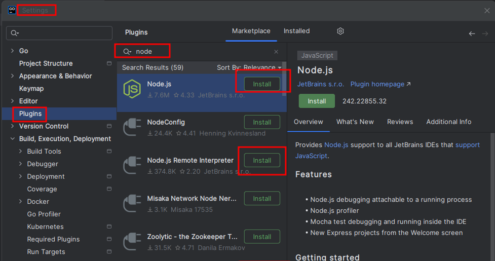
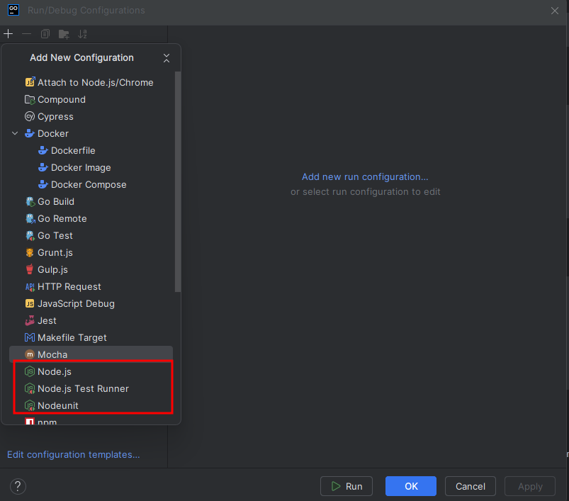
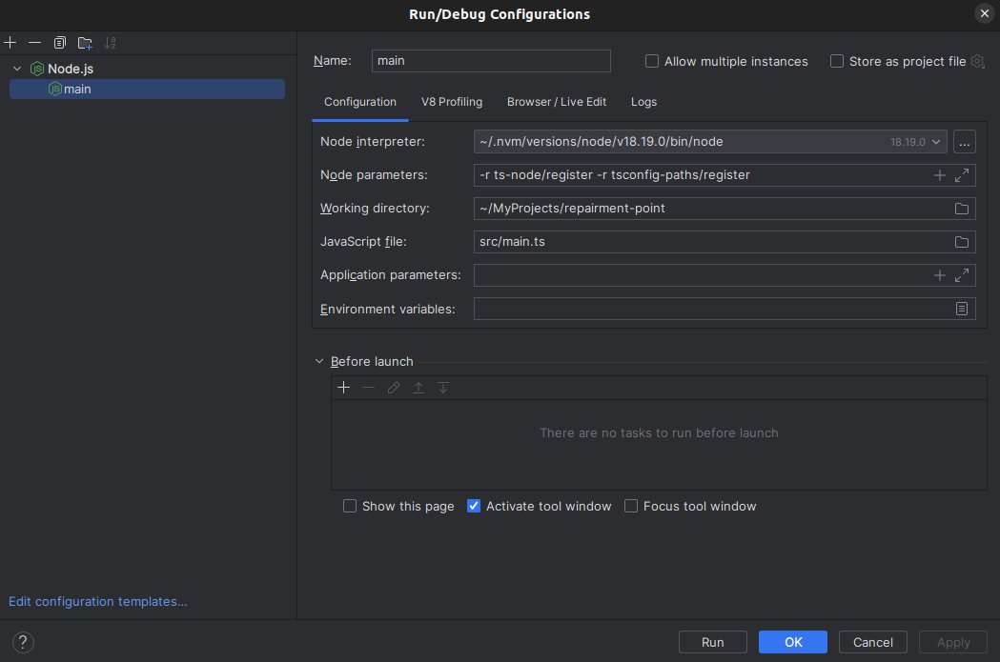

# Node.js knowledge

1. To add Node.js configuration type to GoLand IDE, go to Settings -> Plugins and install Node.js plugin. After IDE restart the new configuration will appear.

2. To configure debugger for Nest.js in the IntelliJ IDE, add configuration as on picture below.

